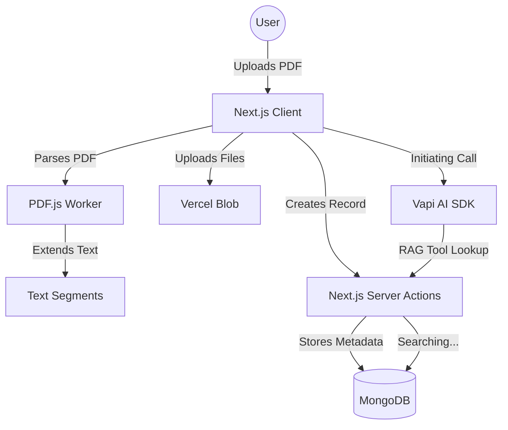

# 🎙️ TalkBook: Revolutionary AI-Powered Library

**TalkBook** is a state-of-the-art SaaS platform that transforms static PDF books into dynamic, interactive AI voice conversations. Built for the modern researcher, student, and lifelong learner, it bridges the gap between traditional reading and conversational learning.

---

### 📸 Visual Preview

| 🚀 Hero Experience | 📚 Smart Library |
| :---: | :---: |
|  |  |

| 🎙️ AI Voice Interaction | 💳 Premium Plans |
| :---: | :---: |
|  |  |

---

## 📘 The Complete Technical Guide

Explore the architectural masterpieces that power TalkBook:

-   **[🏗️ Master Engineering Manual](app/docs/ENGINEERING_MANUAL.md)**: The "Full Guide" covering the entire system blueprint.
-   **[📄 PDF Synthesis Engine](app/docs/pdf-parsing.md)**: Deep dive into client-side worker processing and sliding-window segmentation.
-   **[🎙️ Voice & AI Integration](app/docs/voice-integration.md)**: Explanation of the Vapi + ElevenLabs real-time pipeline and RAG logic.
-   **[🗄️ Database & Search Strategy](app/docs/database-design.md)**: How we scale MongoDB with hybrid search patterns.
-   **[✨ Frontend & UI Engineering](app/docs/frontend-engineering.md)**: Secrets behind our Glassmorphism aesthetic and performance optimizations.
-   **[🔐 Authentication & Middleware](app/docs/authentication-clerk.md)**: Full guide on Clerk integration and route protection.

---

## ✨ Key Technical Highlights

### 🧠 Intelligent Context Retrieval (RAG)
*   **Weighted Search**: Uses MongoDB `$text` scores combined with a keyword-based Regex fallback to ensure 100% accuracy in AI responses.
*   **Client-Side Heavy Lifting**: Implements heavy-duty PDF.js processing in a background worker to keep the UI buttery smooth.

### 🎙️ Hyper-Realistic Conversations
*   **Indiscernible Voice Synthesis**: Powered by ElevenLabs' `eleven_turbo_v2_5` model for ultra-low latency and human-like emotion.
*   **Real-time Word Streaming**: Transcripts flow to the UI in real-time as the AI "thinks" and "speaks".

### ⚡ Premium Engineering
*   **Streaming & Suspense**: Optimized for zero-wait UI. The page structure appears instantly while data streams in.
*   **Advanced Caching**: Leverage Next.js `unstable_cache` with granular revalidation tags for sub-second library loads.

---

## 🏗️ System Architecture

---

## 🚀 Professional Engineering Values

This project demonstrates expertise in:
1.  **Complexity Management**: Handling large binary files (PDFs) and converting them into searchable segments.
2.  **Next-Gen Web Patterns**: Implementing **Streaming**, **Suspense**, and **Server Components** for maximum performance.
3.  **Enterprise Integrations**: Orchestrating Clerk, Vercel Blob, ElevenLabs, and Vapi AI into a single cohesive experience.
4.  **UI/UX Excellence**: Creating a responsive, accessible, and high-fidelity design system that wows at first glance.

---

Built with ❤️ by [Ahmed Adel](https://github.com/AhmedAdel208)
